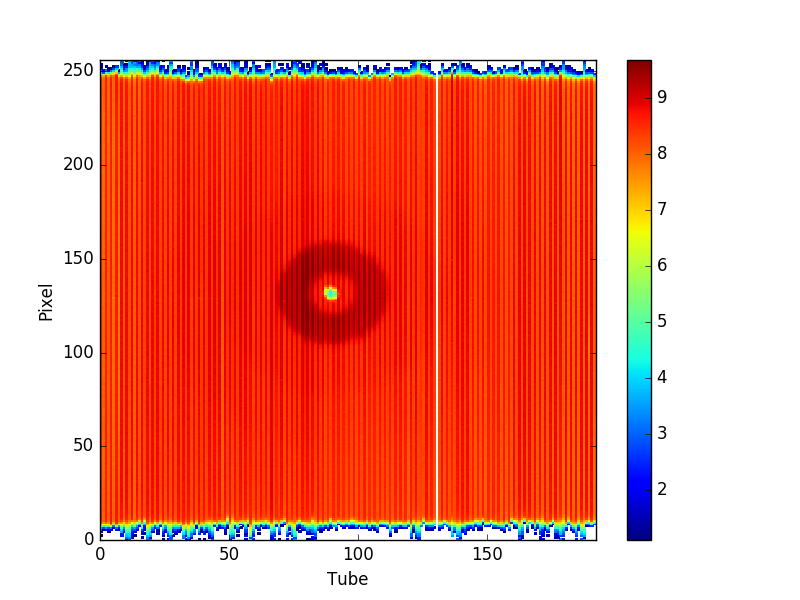

# autoreduce-plot

Extending some code to produce 2D plots of Mantid detector readings so that it
can also render to the browser using Plotly.

# Installation

There are Makefile targets to do each part of the installation. To just see
which command would have been executed, add the `-n` flag to each invocation of
`make`. For instance, `make -n depend` instead of `make depend` will show you
what it would have done.

Set up a virtual environment:

```bash
$ python -m virtualenv venv
$ source venv/bin/activate
```

Install dependencies and add Mantid to path:

```bash
(venv) $ make depend
```

# Running

Running with `--help` will show arguments.

```bash
(venv) $ ./reduce_EQSANS.py --help
FrameworkManager-[Notice] Welcome to Mantid 3.7.1
FrameworkManager-[Notice] Please cite: http://dx.doi.org/10.1016/j.nima.2014.07.029 and this release: http://dx.doi.org/10.5286/Software/Mantid3.7.1
usage: reduce_EQSANS.py [-h] filename outdir

positional arguments:
  filename
  outdir

optional arguments:
  -h, --help  show this help message and exit
```

An example of running on some test data:

```bash
(venv) $ ls
EQSANS_66051_histo.nxs  README.md         requirements.txt
Makefile                reduce_EQSANS.py  venv
(venv) $ mkdir out
(venv) $ ./reduce_EQSANS.py EQSANS_66051_histo.nxs out/
FrameworkManager-[Notice] Welcome to Mantid 3.7.1
FrameworkManager-[Notice] Please cite: http://dx.doi.org/10.1016/j.nima.2014.07.029 and this release: http://dx.doi.org/10.5286/Software/Mantid3.7.1
Load-[Notice] Load started
Load-[Notice] Load successful, Duration 19.45 seconds
Integration-[Notice] Integration started
Integration-[Notice] Integration successful, Duration 0.71 seconds
(venv) $ ls out/
EQSANS_66051_autoreduced.png
```


